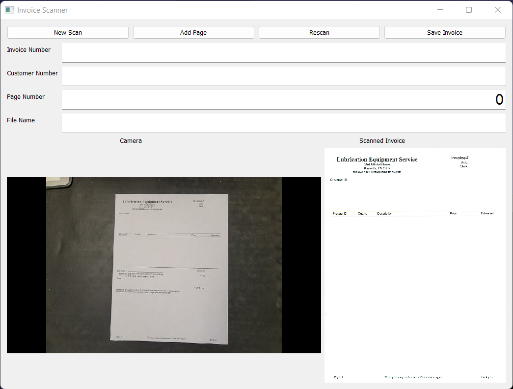
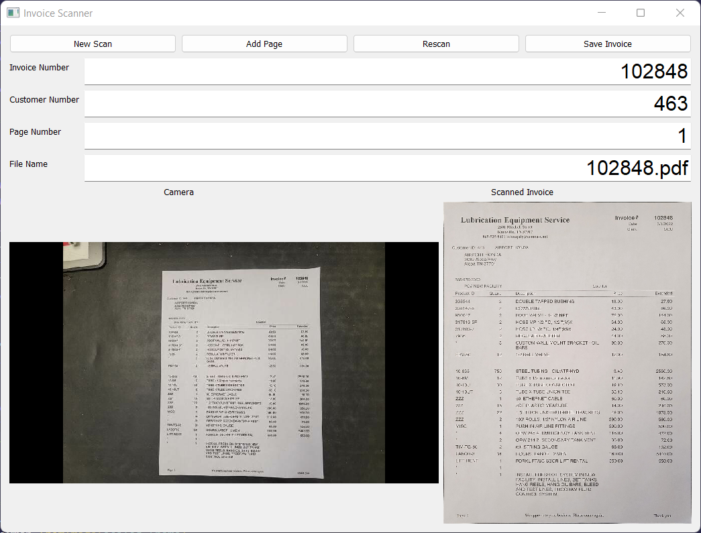

# InvoiceScanner

Working in retail for 10 years, I noticed a practice that larger companies take but is usually forgotten by smaller ones. That being scanning invoices. Larger companies will take all the retail invoices for the day and scan them into a file so they have not only the physical copy but a digital copy with a customer’s signature, for example. This allows for quicker confirmation of payment and gives the companies full copies they can attach through their accounts payable portals. This program uses Python and PyQt5 to streamline this for smaller companies who many do not have the larger copy machines. Attach a webcam and let the program snap a photo of the invoice. It will then find the largest rectangle, crop, transform, and use machine learning to detect the text in predetermined regions. Then you can save the invoice to a file with the invoice number pre-filled. 

## Libraries required
```
OpenCV         - for image detection

PyQt5 or PyQt6 - used for the GUI

PyTesseract    - used for text detection

Numpy          - used for matrix translation
```

This is a passion project. Feel free to fork, change, and edit. Some features have been commented out as they were not needed by the company I am currently with.


# Initial Open Example



# Scanned Invoice Example



# Followup

The detail of the images on the GUI are intentionally set at a low resolution. I designed this to run on a machine running OS X Mavericks. The image that is cropped, however, is set to the highest resolution the webcam can run. So the saved image will be a much better quality. 
